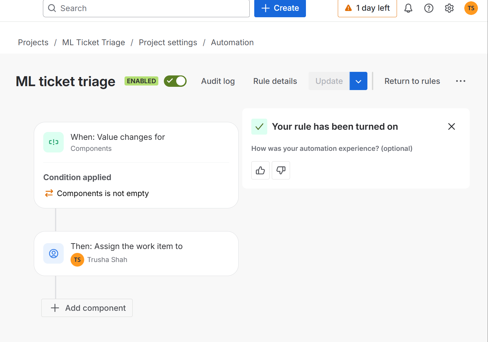
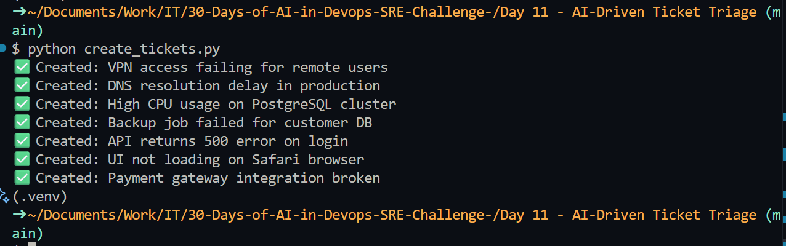
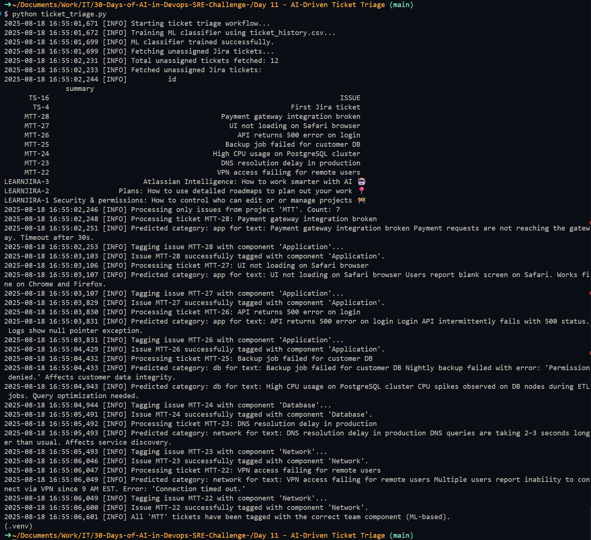
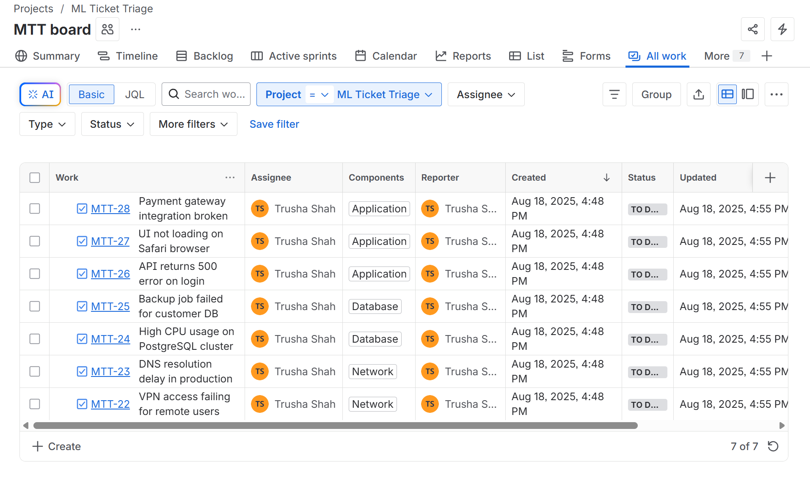

# Day 11: AI-Driven Ticket Triage – Step-by-Step Solution 🚦

This guide explains how to automatically triage and tag Jira tickets using ML/NLP, and how to configure Jira for automated team assignment via components.

---

## Step 1: Introduction & Planning 📝
**Why:**  
Manual ticket triage is slow and error-prone. Automating it saves time and improves accuracy.

**How:**  
Use ML/NLP to analyze ticket summaries and descriptions, classify them into categories, and tag them with Jira components for team-based assignment.

**What did I get:**  
A clear plan for automating ticket triage and assignment using Jira components.

---

## Step 2: Install Required Libraries 🧩
**Why:**  
pandas for data manipulation; requests for Jira API access; scikit-learn for ML classification.

**How:**  
```sh
pip install pandas requests scikit-learn --quiet
```

**What did I get:**  
All necessary Python libraries installed.

---

## Step 3: Prepare Historical Ticket Data for ML Training 📄
**Why:**  
A labeled dataset is needed to train the ML classifier.

**How:**  
- Create `ticket_history.csv` with columns: `id,summary,description,category`.
- Categories should match your Jira components: `network`, `db`, `app`.

**What did I get:**  
A training dataset for the ML model.

---

## Step 4: Train ML Model for Ticket Classification 🧠
**Why:**  
ML model can automatically classify tickets into categories based on text.

**How:**  
- Use TF-IDF vectorization on summary + description.
- Train a **Multinomial Naive Bayes classifier** (from scikit-learn) on labeled data.
- Save training logic in `ticket_triage.py`.

**Which classifier and why:**  
- **Multinomial Naive Bayes** is chosen because it is simple, fast, and effective for text classification tasks where features are word counts or frequencies.
- It works well with TF-IDF features and small-to-medium datasets, making it ideal for ticket categorization based on summary and description text.

**What did I get:**  
A trained ML model that predicts ticket category.

---

## Step 5: Jira Component Setup & Auto-Assignment Logic 🏢

### Jira Component Setup
- ✅ Created components: Network, Database, Application
- ✅ Set Component Lead for each (currently you)
- ✅ Set Default Assignee to Component Lead for each component

### ⚠️ Jira Only Auto-Assigns at Issue Creation Time
Jira checks the component’s default assignee only when the issue is created — not when the component is updated later.

If your script updates the component after the ticket is created, Jira won’t reassign it automatically.

---

## Step 6: Jira Automation for Component-Based Assignment 🔧

**Why:**  
Ensure tickets updated by your script are assigned to the correct Component Lead.

**How:**  
Set up a Jira Automation rule:
- **Trigger:** Field value changed → Component
- **Condition:** Component is not empty
- **Action:** Assign issue → Component Lead

This guarantees that any ticket updated by your script gets assigned properly, even after creation.

**What did I get:**  
Automated assignment to the Component Lead whenever the component is updated.

**Example Jira Automation Configuration:**


---

## Step 7: Creating Tickets Programmatically (`create_tickets.py`) 📝

**Why:**  
To test and demonstrate the triage workflow, you need sample tickets in Jira.

**How:**  
- The `create_tickets.py` script creates sample tickets in your Jira project using the REST API.
- Each ticket includes a summary, description (in Atlassian Document Format), and relevant labels.
- The script uses your Jira credentials and project key to authenticate and create issues.

**What did I get:**  
A set of realistic incident tickets in Jira, ready for triage and auto-assignment by your ML-powered workflow.



---

## Step 8: Fetch Unassigned Jira Tickets via API 🔄
**Why:**  
Need to process only new, unassigned tickets.

**How:**  
- Use Jira REST API to search for tickets with `assignee is EMPTY AND status = 'To Do' and component is EMPTY`.
- Extract summary and description for classification.

**What did I get:**  
A DataFrame of new, unassigned Jira tickets.

---

## Step 9: ML-Based Ticket Categorization & Tagging 🤖
**Why:**  
Automatically tag tickets with the correct Jira component for team assignment.

**How:**  
- For each ticket, use the ML model to predict category (`network`, `db`, `app`).
- Map predicted category to Jira component (`Network`, `Database`, `Application`).
- Use Jira API to update each ticket, tagging it with the correct component.

**What did I get:**  
Tickets tagged with the right component, visible in team queues.

---

## Step 10: Script Execution 🚀

**Why:**  
Run the full workflow to triage and tag tickets in Jira.

**How:**  
- Execute `ticket_triage.py` to fetch, classify, and tag tickets.
- Monitor logs for ticket processing and tagging status.

**What did I get:**  
A fully automated ticket triage and tagging workflow, with logs for every step.


---

## Step 11: Review & Iterate 🔄
**Why:**  
Continuously improve the model and process based on feedback and performance.

**How:**  
- Review misclassified tickets and adjust the model or training data.
- Gather feedback from teams on ticket quality and triage accuracy.

**What did I get:**  
An iterative process for continuous improvement of ticket triage automation.

---

## What Did I Learn 🧩
- ML can effectively classify and triage tickets, saving significant manual effort.
- Tagging tickets with Jira components enables team-based assignment and queueing.
- Integrating Python scripts with Jira API enables powerful automation workflows.
- Continuous monitoring and iteration are key to maintaining and improving automation accuracy.

#