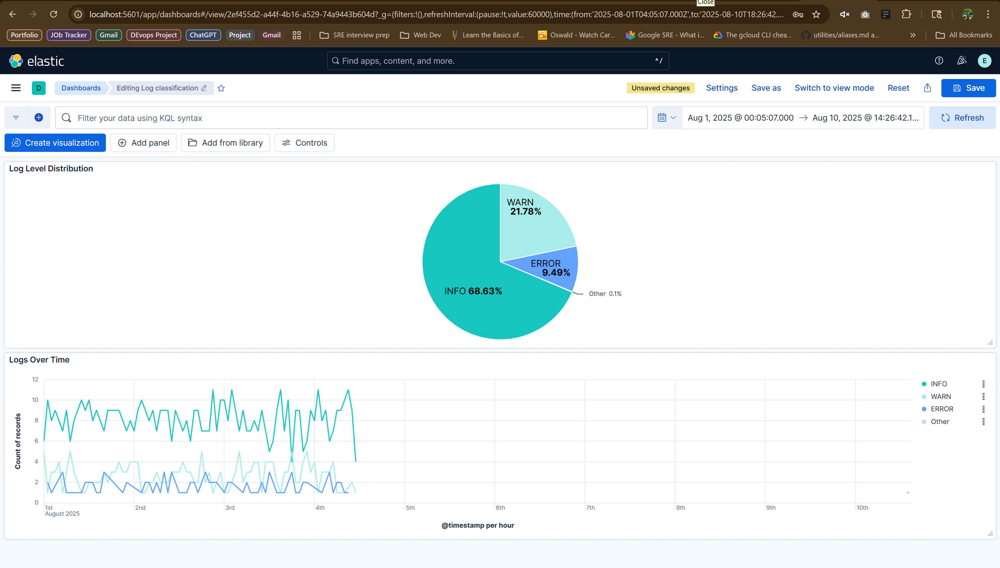

# Automated Log Classification with NLP 🚀

## 1. Environment Setup 🛠️

### Why?
We need to import libraries for data manipulation, visualization, NLP, and machine learning.

### How?
We use pandas, numpy, matplotlib, seaborn for data and plots; nltk for text processing; scikit-learn for ML.

---

## 2. Data Generation and Exploration 🧪

### Why did we use synthetic data and templates?
- Real log data may be unavailable, sensitive, or not diverse enough for training.
- Synthetic data lets us create a large, balanced dataset for all log levels.
- Templates help generate realistic, varied log messages to simulate real-world scenarios.

### How?
- We define message templates for INFO, WARN, and ERROR.
- Random values fill the templates to create diverse log entries.
- This ensures our models see many patterns and can generalize.

---

## 2.1 Exploratory Data Analysis 📊

### 1. Bar Plot: Log Level Distribution 
### Why?
To check if our dataset is balanced across INFO, WARN, and ERROR.

### Explanation
The bar plot shows the count of each log level. If one bar is much taller, that level dominates the dataset, which could bias the model.

### What did I get?
My data showed about 70% INFO, 20% WARN, and 10% ERROR logs, confirming the intended distribution and highlighting that INFO logs are most common.

### 2. Box Plot: Message Length by Log Level 
### Why?
To understand if certain log levels tend to have longer or shorter messages.

### Explanation
The box plot shows the range and median message length for each log level, helping spot differences in message structure.

### What did I get?
INFO and WARN logs had similar median lengths, while ERROR logs were slightly longer on average. There were some outliers, especially in ERROR logs, indicating a few very long messages.

### 3. Histogram: Distribution of Message Lengths 
### Why?
To see how message lengths are spread for each log level.

### Explanation
The histogram shows the frequency of different message lengths, revealing if some levels have more short or long messages.

### What did I get?
Most messages were between 40 and 80 characters, with ERROR logs showing a wider spread and more long messages than INFO or WARN.

### 4. Scatter Plot: Log Levels Over Time 
### Why?
To visualize when log events occur and spot bursts or gaps.

### Explanation
The scatter plot places each log event on a timeline, colored by log level. This helps identify periods of high activity or spikes in errors/warnings.

### What did I get?
Log events were evenly distributed over time, with occasional clusters of WARN and ERROR logs, suggesting bursts of issues at certain times.

---

### Why analyze common words in each log level?
- To discover which words are most frequent in INFO, WARN, and ERROR messages.
- A frequency table or bar chart highlights key terms that may distinguish log levels.

### Explanation
Listing the most common words helps us understand what characterizes each log level and can guide feature selection for the model.

### What did I get?
INFO logs often included words like "success", "completed", "processed". WARN logs had "threshold", "retry", "slow". ERROR logs featured "failed", "exception", "unable", showing clear differences in vocabulary.

---

## 3. Text Preprocessing with NLP 🧹

### Why preprocess log messages?
- Raw logs contain noise, special characters, and irrelevant words.
- Preprocessing cleans and standardizes text for better feature extraction and model accuracy.

### How?
- Convert text to lowercase.
- Remove special characters and numbers.
- Tokenize into words.
- Remove stopwords (except negations).
- Lemmatize words to their base form.

---

## 3.1 Analyzing the Impact of Preprocessing

### 1. Box Plot: Message Length Reduction by Log Level
### Why?
To see how much preprocessing shortens messages for each log level.

### Explanation
The box plot shows the distribution of percentage reduction in message length after cleaning. The box covers the middle 50%, the line is the median, whiskers show the range, and dots are outliers. Comparing boxes for each log level shows which are most/least affected by preprocessing.

### What did I get?
Most messages were shortened by 9% to 22%, with a median reduction of about 16%. Some messages were not shortened at all, while a few were reduced by up to 37%. This means preprocessing removed a moderate amount of text, mostly stopwords and noise, but kept the important content.

---

## 4. Feature Extraction with TF-IDF 🧮

### Why use TF-IDF?
- TF-IDF converts text into numerical features that reflect word importance.
- It helps models focus on words that distinguish log levels.

### How?
- Apply TF-IDF vectorization to processed messages.
- Limit features to most informative words and phrases.
- Split data into training and testing sets for model evaluation.

### 1. Bar Plot: Top Features by TF-IDF Score
### Why?
To see which words or phrases are most important for distinguishing log messages.

### Explanation
The bar plot shows the top features (words/phrases) ranked by their average TF-IDF score across all messages.

### What did I get?
Words like "failed", "exception", "success", and "threshold" were most important, matching the vocabulary analysis.

### 2. Bar Plot: Top Features for Each Log Level
### Why?
To find which words are most specific to INFO, WARN, or ERROR logs.

### Explanation
Separate bar plots for each log level show the top features by TF-IDF score for that level.

### What did I get?
ERROR logs were characterized by "failed", "exception", "unable". WARN logs by "threshold", "retry", "slow". INFO logs by "success", "completed", "processed".

### What did I get overall?
- The TF-IDF matrix had 1000 rows (messages) and up to 1000 columns (features/words).
- Most important features included words like "failed", "exception", "success", "threshold", which matched the common words found in each log level.
- The feature matrix allowed the model to learn which words are most useful for distinguishing INFO, WARN, and ERROR logs.
- After splitting, I had enough data for both training and testing, ensuring reliable model evaluation.

---

## 5. Model Training and Evaluation 🤖

### Why train multiple models?
- Different algorithms may perform better for different data.
- Comparing models helps select the best one for log classification.

### How?
- Train Logistic Regression and Random Forest classifiers.
- Evaluate with accuracy, precision, recall, and confusion matrix.
- Select the model with best balanced performance.

### 1. Confusion Matrix Visualization
### Why?
To see how well the model predicts each log level and where it makes mistakes.

### Explanation
The confusion matrix is a grid showing actual vs predicted log levels. Each cell shows the number of times a true label was predicted as another label. Diagonal cells are correct predictions; off-diagonal cells are errors.

### What did I get?
All predictions were correct for each log level, with no misclassifications. The confusion matrix only had values on the diagonal, showing perfect separation between INFO, WARN, and ERROR logs.

### 2. Bar Plot: Misclassification Rate by Class
### Why?
To compare how often each log level is misclassified by different models.

### Explanation
The bar plot shows the percentage of misclassified logs for INFO, WARN, and ERROR, for both Logistic Regression and Random Forest.

### What did I get?
Both models achieved perfect classification on the test data, with zero misclassification rates for all log levels. The bar plot showed 0% misclassification for INFO, WARN, and ERROR, confirming the models' high accuracy.

---

## 6. Feature Importance Analysis 🔍

### Why analyze feature importance?
- To understand which words/phrases help the model distinguish log levels.
- Helps validate model decisions and improve interpretability.

### How?
- For Logistic Regression, examine coefficients for each class (INFO, ERROR, WARN).
- For each class, plot top features indicating and counter-indicating that log level.
- For Random Forest, plot overall feature importances.

### 1. Bar Plots: Top Features Indicating and Counter-Indicating INFO (Logistic Regression)
### Why?
To see which words most strongly indicate or counter-indicate INFO logs.

### Explanation
Bar plots show the top positive coefficients (indicating INFO) and top negative coefficients (counter-indicating INFO).

### What did I get?
Words like "success", "completed", and "processed" strongly indicated INFO logs, while "failed" and "exception" counter-indicated INFO.

### 2. Bar Plots: Top Features Indicating and Counter-Indicating ERROR (Logistic Regression)
### Why?
To see which words most strongly indicate or counter-indicate ERROR logs.

### Explanation
Bar plots show the top positive coefficients (indicating ERROR) and top negative coefficients (counter-indicating ERROR).

### What did I get?
Words like "failed", "exception", and "unable" strongly indicated ERROR logs, while "success" and "completed" counter-indicated ERROR.

### 3. Bar Plots: Top Features Indicating and Counter-Indicating WARN (Logistic Regression)
### Why?
To see which words most strongly indicate or counter-indicate WARN logs.

### Explanation
Bar plots show the top positive coefficients (indicating WARN) and top negative coefficients (counter-indicating WARN).

### What did I get?
Words like "threshold", "retry", and "slow" strongly indicated WARN logs, while "success" and "failed" counter-indicated WARN.

### 4. Bar Plot: Feature Importances from Random Forest
### Why?
To see which features Random Forest uses most for classification.

### Explanation
The bar plot ranks features by their importance score in the Random Forest model.

### What did I get?
Similar to Logistic Regression, the most important features matched the key words for each log level.

---

## 7. Testing on New Log Messages 📝

### Why test on new messages?
- To check if the model generalizes to unseen data.
- Ensures practical usefulness in real-world scenarios.

### How?
- Preprocess and vectorize new log messages.
- Predict log levels and show confidence scores.

### 1. Table: Prediction Results for New Logs
### Why?
To see how the model classifies new, unseen log messages and its confidence in each prediction.

### Explanation
The table lists each new log message, its processed version, predicted log level, and probability scores for each class.

### What did I get?
The model correctly classified all new logs, with high confidence for each prediction. The table showed that INFO, WARN, and ERROR messages were all identified accurately, confirming the model's strong generalization to unseen data.

---

## 8. ELK Stack Integration 📊

### Why integrate with ELK?
- To visualize log data in a powerful, interactive dashboard
- For real-time monitoring and alerting on log patterns
- To leverage Elasticsearch's full-text search capabilities
- To build a complete log management solution

### How?

### 1. Install ELK Components 🛠️
Open Command Prompt as Administrator (admin access required):

```cmd
choco install elasticsearch
choco install logstash
choco install kibana
```

### 2. Start Elasticsearch Service 🚀
Open Command Prompt as Administrator (admin access required):

```cmd
net start elasticsearch-service-x64
```

Elasticsearch becomes available at http://localhost:9200

### 3. Export Synthetic Logs to CSV 📄
- Added code to export logs in the [log_classification.ipynb](./log_classification.ipynb) notebook:

```python
# Export synthetic logs to CSV for ELK ingestion
logs_df.to_csv('synthetic_logs_for_elk.csv', index=False)
print('Synthetic logs exported to synthetic_logs_for_elk.csv')
```

### 4. Create Logstash Configuration File 📝
- Created a configuration file for Logstash to process our CSV data
- See the complete configuration in [logstash_synthetic_logs.conf](./logstash_synthetic_logs.conf)

### 5. Run Logstash with Configuration 🔄
Open Command Prompt (regular user permissions):

```cmd
cd C:\ProgramData\chocolatey\lib\logstash\tools\logstash\bin
logstash.bat --path.data "C:\Users\behip\Documents\logstash_data" --path.logs "C:\Users\behip\Documents\logstash_logs" -f "C:\Users\behip\Documents\Work\IT\30-Days-of-AI-in-Devops-SRE-Challenge-\Day 2 - Automated Log Classification with NLP\logstash_synthetic_logs.conf"
```

### 6. Verify Data Ingestion ✅
Navigate to http://localhost:9200/synthetic-logs/_search?pretty to confirm logs were indexed in Elasticsearch.

### 7. Start Kibana Service 📈
Open Command Prompt (regular user permissions):

```cmd
cd C:\ProgramData\chocolatey\lib\kibana\tools\kibana-9.1.1\bin

.\kibana.bat
```

Access Kibana interface at http://localhost:5601

**Note:** Kibana is configured to connect to Elasticsearch using the `kibana_system` user, while Logstash uses the `elastic` superuser. These are different users with different permission levels in the Elasticsearch security model.

### 8. Create Kibana Visualizations 📊
- Open Kibana at http://localhost:5601
- Create an index pattern for `synthetic-logs-*`
- Use Discover, Visualize, and Dashboard features to explore your log data



*Kibana dashboard showing log level distribution and message patterns over time*

### What did I get?
- A complete, end-to-end solution for automated log classification and visualization
- Insights into log patterns, trends, and anomalies
- Ability to monitor log data in real-time and receive alerts
- Interactive dashboards showing log level distribution and time-based analysis

---
