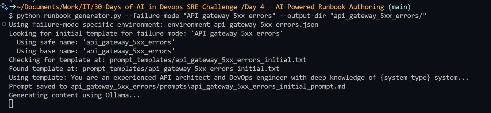

# Day 4: AI-Powered Runbook Authoring - Step-by-Step Solution

## 1. Understanding the Task 🧠

### Why?
- Runbooks are critical for incident response but time-consuming to create
- Technical accuracy is essential but requires deep domain knowledge
- Documentation style and completeness varies between authors
- Runbooks often lack clear validation steps or troubleshooting alternatives

### How?
By using a Large Language Model (LLM) to:
- Generate structured runbook templates
- Propose comprehensive remediation steps
- Include validation checks at each stage
- Provide alternative approaches when initial steps fail

## 2. Selecting the Right Tools 🛠️

### Why choose Ollama?
- Runs locally, ensuring data privacy for sensitive system details
- Provides high-quality technical responses with Llama 2 model
- No API costs or usage limits
- Simple API for programmatic integration
- Consistent performance without internet dependency

### How?
- Used Ollama with the Llama 2 model for local processing
- Kept sensitive architectural details within our environment
- Maintained human validation for technical accuracy

## 3. Designing the Initial Prompt 📝

### Why?
- LLM output quality depends heavily on prompt design
- Need to specify technical depth and expected format
- Must ensure practical, actionable steps

### How?
Created a structured prompt with:
1. **Context**: Detailed explanation of database connection leaks
2. **Environment**: Our technology stack and constraints
3. **Format requirements**: Clear sections for detection, investigation, remediation
4. **Expectations**: Include commands, expected outputs, and verification steps

### The Initial Prompt:

```bash
prompt_templates/database_connection_leak_initial.txt
```

This template-based approach ensures:
- Consistent initial prompt structure
- Specialized prompts for each failure mode
- Ability to iterate on prompt design over time
- Clear documentation of prompt engineering practices

## 4. Evaluating and Refining the Runbook 🔍

### Why?
- Initial LLM output may contain:
  - Generic solutions that don't fit our environment
  - Missing edge cases or validation steps
  - Incorrect assumptions about our infrastructure

### How?
1. Reviewed the initial runbook with database experts
2. Identified gaps in monitoring recommendations
3. Added missing connection pooling configuration details
4. Enhanced verification steps with specific metrics
5. Created a refined prompt addressing these gaps

### The Refined Prompt:

```bash
prompt_templates/database_connection_leak_refinement.txt
```

This template-based approach allows us to:
- Maintain consistent refinement patterns across team members
- Version control our prompt evolution
- Adapt refinement strategies for each specific failure mode
- Easily modify prompts without changing the core script

## 5. Validating Through Simulation 🧪

### Why?
- Need to verify runbook effectiveness in realistic scenarios
- Identify any missing steps or unclear instructions
- Ensure junior engineers can follow the procedures

### How?
1. Created a test environment with deliberate connection leaks
2. Had engineers follow the runbook without additional guidance
3. Documented areas where they encountered confusion
4. Added clarifications and screenshots to improve usability
5. Incorporated feedback into the final version

## 6. Final Runbook Production 📑

### Why?
- Need a clean, professional document for the knowledge base
- Must be easily searchable and navigable
- Should include appropriate metadata and categorization

### How?
1. Formatted the validated content into Markdown
2. Added table of contents and section navigation
3. Included version history and last-reviewed date
4. Added tags for searchability in our documentation system
5. Published to our internal knowledge base with appropriate permissions

## 7. Running the Python Script 🐍

### Why?
- Need an automated way to generate runbooks consistently
- Want to make the process repeatable and shareable
- Different team members should be able to use the same methodology
- Support for multiple LLM providers increases flexibility

### How?
1. Created `runbook_generator.py` to automate the runbook creation process
2. Configured the script to support Ollama
3. Implemented interactive refinement capabilities
4. Added functionality to save prompts for documentation

### Usage Instructions

#### Generating Runbooks for Different Failure Modes

The script automatically detects and uses the corresponding custom environment files and prompt templates for each failure mode:

```bash
# Database connection leaks
python runbook_generator.py --failure-mode "database connection leak"

# High memory usage on Kubernetes
python runbook_generator.py --failure-mode "high memory usage on kubernetes nodes"

# Disk space exhaustion
python runbook_generator.py --failure-mode "disk space exhaustion"

# API Gateway 5xx errors
python runbook_generator.py --failure-mode "api gateway 5xx errors"

# RabbitMQ queue backlog
python runbook_generator.py --failure-mode "rabbitmq queue backlog"

# Load balancer health check failures
python runbook_generator.py --failure-mode "load balancer health check failures"
```

#### Advanced Usage Options

You can customize the generation process:

```bash
# Use a specific Ollama model (default is llama2)
python runbook_generator.py --failure-mode "disk space exhaustion" --model "mixtral"

# Save output to a specific directory
python runbook_generator.py --failure-mode "api gateway 5xx errors" --output-dir "./api_gateway_runbooks"
```



#### Refining Existing Runbooks

To refine an existing runbook:

```bash
# Refine an existing runbook (enters interactive mode)
python runbook_generator.py --input-runbook "database_connection_leak/initial_runbook.md"

# Specify both input file and failure mode if needed
python runbook_generator.py --input-runbook "path/to/custom_runbook.md" --failure-mode "database connection leak"
```

### Command-line Options:
- `--failure-mode`: The failure mode to create a runbook for
- `--model`: Ollama model to use (e.g., `llama2`, `mixtral`, etc.)
- `--environment-file`: Override the default environment file
- `--output-dir`: Directory to save generated runbooks
- `--interactive`: Enable interactive refinement mode
- `--input-runbook`: Path to existing runbook file to refine

## 8. Customizing for Different Failure Modes 🧩

### Why?
- Different failure types require specialized knowledge and commands
- Generic prompts may not capture the nuances of specific technologies
- Environment details vary across different system components
- Each failure mode benefits from tailored troubleshooting approaches

### How?
1. **Created custom environment files for each failure mode**:
   - Used naming pattern: `environment_<failure_mode>.json`
   - Added specific details relevant to each technology stack
   - Prioritized configuration parameters most relevant to the failure type

2. **Developed specialized prompt templates**:
   - Created a `prompt_templates/` directory structure
   - Added initial prompt templates (`<failure_mode>_initial.txt`)
   - Created refinement prompt templates (`<failure_mode>_refinement.txt`)
   - Tailored each template with domain-specific guidance and suggestions

3. **Enhanced the Python script**:
   - Added logic to check for failure-mode specific environment files
   - Implemented template loading based on failure mode
   - Preserved backwards compatibility with default templates
   - Made the process transparent with informative logging

### Example Customizations

We created specialized environments and prompts for six common failure modes:

1. **Database Connection Leaks**
   - Custom environment with PostgreSQL details and connection pool settings
   - Initial prompt focused on HikariCP, Spring Boot, and connection tracking
   - Example commands for identifying leaking connections in production

2. **High Memory Usage on Kubernetes**
   - Environment details including K8s version, node types, and monitoring tools
   - Specialized prompt for container memory limits and OOMKilled scenarios
   - Remediation strategies specific to Kubernetes environments

3. **Disk Space Exhaustion**
   - Environment with Linux filesystem details and AWS EBS volumes
   - Initial prompt for Linux disk management and emergency procedures
   - Refinement prompt with focus on logrotate, inode management, and Docker cleanup

4. **API Gateway 5xx Errors**
   - AWS API Gateway specific environment details
   - Custom prompt for error patterns and backend service troubleshooting
   - Specific CloudWatch and X-Ray command examples

5. **RabbitMQ Queue Backlog**
   - Messaging-specific environment with cluster details
   - Prompt tailored to queue monitoring and consumer scaling
   - Commands for message TTL and dead letter queue management

6. **Load Balancer Health Check Failures**
   - AWS ALB configuration details in environment file
   - Network-focused prompt for health check troubleshooting
   - Guidance on handling failures during deployments

This approach resulted in runbooks that are:
- More technically accurate for each specific failure mode
- Rich with relevant commands and troubleshooting approaches
- Properly contextualized to the right environment
- Better structured around the unique aspects of each technology

## 9. Results and Benefits 🏆

This AI-assisted approach to runbook creation:
1. Reduced creation time from days to hours
2. Ensured comprehensive coverage of detection, investigation, and remediation
3. Standardized format and technical depth across documentation
4. Included verification steps often overlooked in manual creation
5. Provided a template for future runbook development

The human-in-the-loop approach ensured technical accuracy while leveraging AI for structure, comprehensiveness, and clarity.
