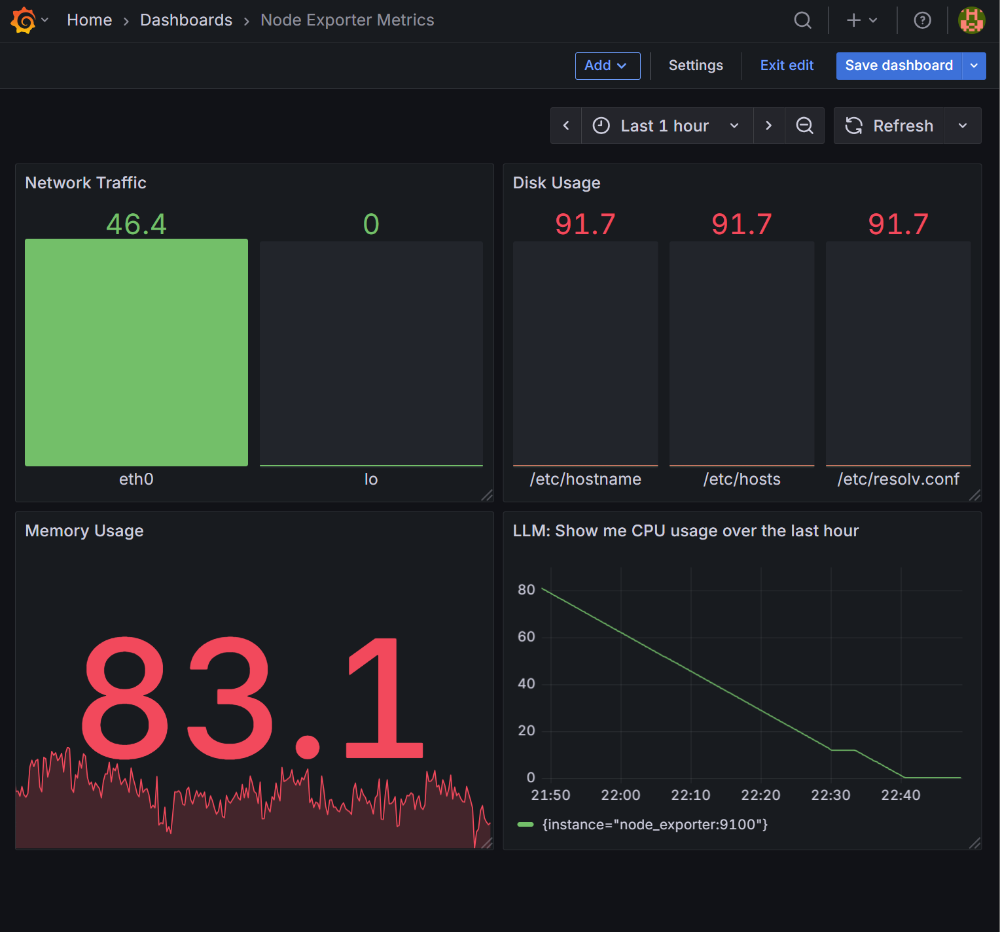

# 📋 Step-by-step Solution – Day 18: Natural-Language Dashboard Queries

---

## 📝 Step 1: Introduction & Planning

**Why:**  
PromQL is powerful but not intuitive for all users. Enabling natural language queries in Grafana makes dashboards more accessible and actionable for SRE/DevOps teams.

**How:**  
Use Llama 3 via Ollama to translate user requests into PromQL, then query Grafana and display results.

**What did I get:**  
A fully automated workflow for conversational dashboard queries using local LLM inference and a connected monitoring stack.

---

## ⚙️ Step 2: Install & Run Monitoring Stack

**Install Docker & Docker Compose:**
```bash
# On Ubuntu/Debian
sudo apt-get update
sudo apt-get install docker.io docker-compose
```

- [docker-compose.yml and prometheus.yml](./)  
  *(See this folder for actual files and configuration details)*

**Start Prometheus, Grafana, and Node Exporter:**
```bash
docker-compose up -d
```

**Access services:**
- Prometheus: [http://localhost:9090](http://localhost:9090)
- Grafana: [http://localhost:3000](http://localhost:3000)
- Node Exporter metrics: [http://localhost:9100/metrics](http://localhost:9100/metrics)

---

## 📄 Step 3: Connect Grafana to Prometheus

- Log in to Grafana (`admin`/`admin` by default).
- Go to **Settings → Data Sources → Add data source**.
- Select **Prometheus** and set the URL to `http://prometheus:9090` (or `http://localhost:9090` if running locally).
- Click **Save & Test**.

---

## 🖥️ Step 4: Create Node Exporter Metrics Dashboard

- In Grafana, click **+ → Dashboard → Add new panel**.
- Select your Prometheus data source.
- Enter PromQL queries for CPU, memory, disk, network, etc.
- Save the dashboard.

---

## 🤖 Step 5: LLM Integration – Automated Natural Query to PromQL to Grafana Workflow

**Install Python packages:**
```bash
pip install pandas requests python-dotenv ipywidgets matplotlib
```

**Install and start Ollama:**
- Download from [ollama.com](https://ollama.com/)
- Start server:
  ```bash
  ollama serve
  ```
- Pull the Llama 3 model:
  ```bash
  ollama pull llama3
  ```

**Set up `.env` file:**
```
GRAFANA_API_KEY=your_grafana_api_key
GRAFANA_URL=http://localhost:3000
GRAFANA_DS_UID=your_prometheus_uid
GRAFANA_DASHBOARD_UID=your_dashboard_uid
```

**Run the notebook or script:**
- Open `NLP_Dashboard_queries.ipynb` in Jupyter or VS Code, or run `NLP_Dashboard_queries.py`.
- Enter natural language queries.
- The workflow generates PromQL, queries Grafana, creates dashboard panels, and displays results (including visualizations).

Output in dashboard:
