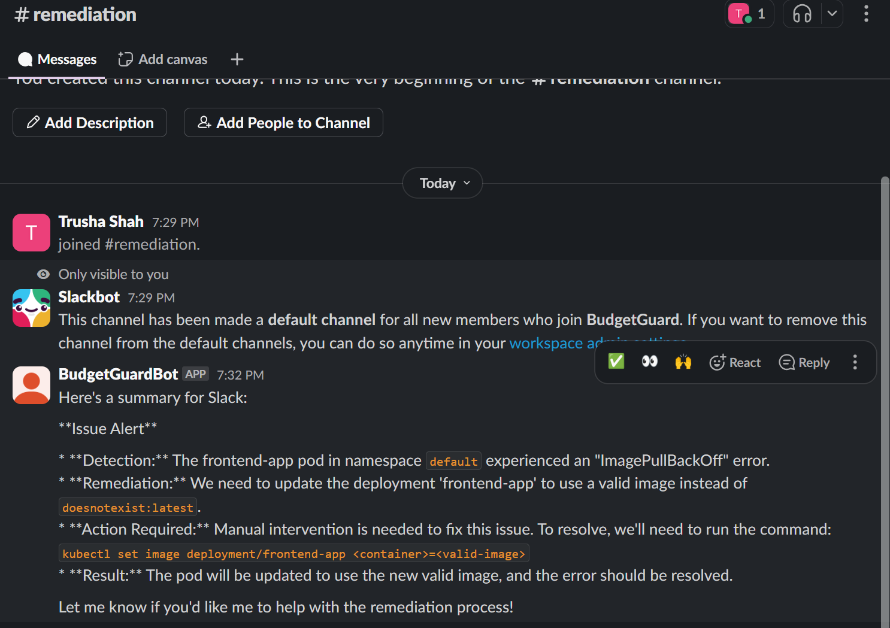

# 📋 Step-by-step Solution – Day 26: ChatOps-Driven Automated Remediation

---

## 📝 Step 1: Introduction & Planning

### 🎯 Overview
Manual remediation is slow and error-prone. This workflow uses a Slack bot and LLM to automate incident response and generate human-friendly confirmation logs.

---

## ⚙️ Step 2: Environment Setup

### 💻 Implementation

**How to set up your environment:**
- Install Python packages:
  ```bash
  pip install slack_sdk openai
  ```
- Set environment variables:
  - `SLACK_BOT_TOKEN`, `OPENAI_API_KEY`, `SLACK_CHANNEL_ID`
- (Optional) Configure Kubernetes access for pod actions

---

## 📄 Step 3: Slack Bot & Remediation Script

### 💻 Implementation

- The bot listens for `/remediate <action>` commands in Slack.
- On command, it runs the remediation script (e.g., restart pods, scale pods, cordon node, cleanup disk, or suggests manual fix for image errors).
- Captures the output for logging.
- The notebook reads `incident.log`, uses ML and pattern matching to predict remediation, extracts targets (app, deployment, pod), and executes or suggests actions.

---

## 🧠 Step 4: LLM Confirmation Log

### 💻 Implementation

- The bot/notebook sends the action and output to an LLM (OpenAI, Ollama, etc.).
- LLM generates a human-friendly confirmation log.
- The log is posted back to Slack for team visibility or printed in the notebook.
- If the issue requires manual intervention (e.g., invalid image), the LLM summarizes the required steps.

Output:
---

## Insights

- ChatOps enables fast, collaborative incident response.
- ML and pattern matching allow dynamic remediation for many error types, including suggestions for manual fixes.
- LLM logs make actions transparent and easy to audit.
- The workflow is extensible for more remediation actions and error types.

---
